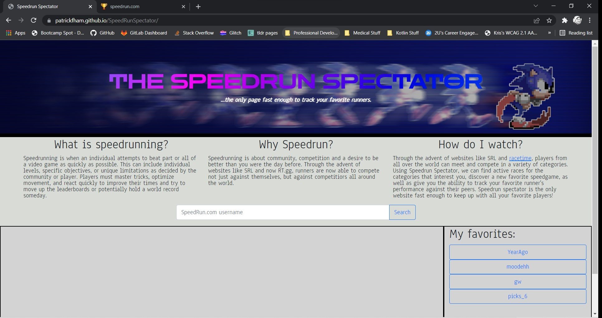
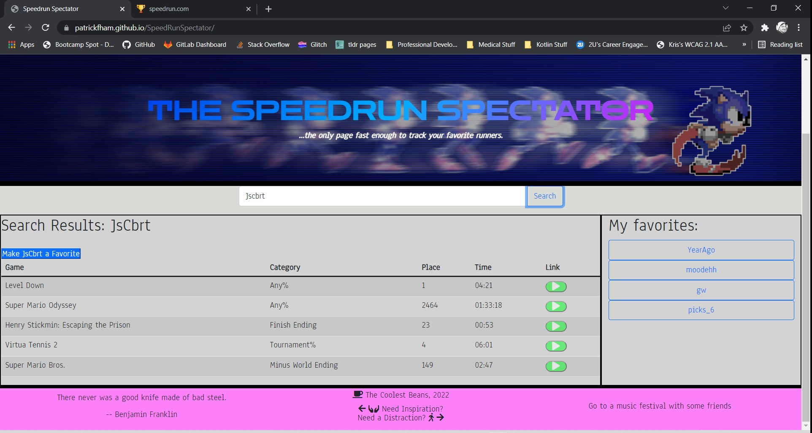
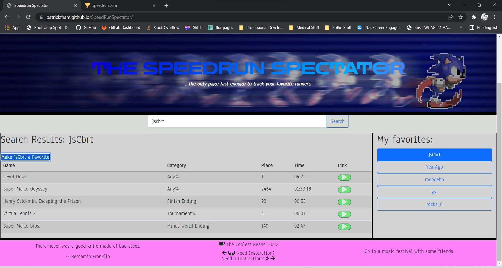

# The Speedrun Spectator
"The Only Page Fast Enough to Track Your Favorite Runners"
Link to the Speedrun Spectator:  https://patrickfham.github.io/SpeedRunSpectator/

# User Stories
As a fan of speedrunning, I want to see the newest runs from my favorite players.
As a follower of many speedrunners, I need a way to see the most recent submissions from my favorite runners.
As a fan of many runners, I need a way to recall my favorites on demand.
As a bad speedrunner, I need inspirational quotes.
As an addicted speedrunner, I need a suggested distraction activity.

# The Goal
A user should be able to search for an SRC user.
A user should be able to add a user to their favorites
A user should be able to recall their favorites from local storage
Users should receive inspiration quotes on search

# How does it work?
The search function will bring up the 5 most recent runs for a user.
If a user has fewer than 5 submitted runs, it will return all runs
Users can save a runner as a favorite which will create a button
If the button is clicked, the search can be rerun at any time
Inspirational quotes will populate on search

# Technologies Used
[SpeedRun.com API](https://github.com/speedruncomorg/api)
[BoredAPI](https://www.boredapi.com/api/activity)
[FreeQuotesAPI](https://free-quotes-api.herokuapp.com)
HTML/CSS/Bootstrap 
JavaScript 
jQuery 

# Video Demo
Link to a demo video: https://drive.google.com/file/d/1xT_eDL0a4Iyi0R-Dyy0Eti2vIRojkjLv/view

# Screenshots

